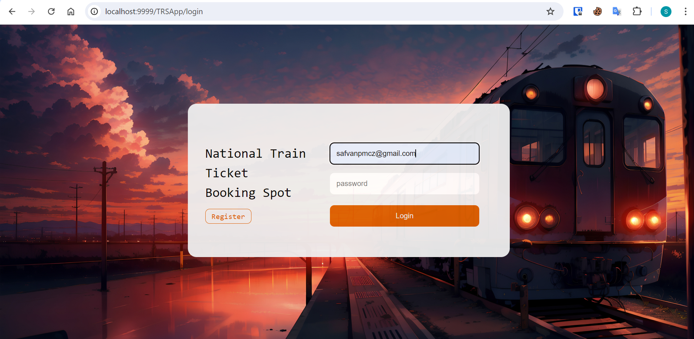
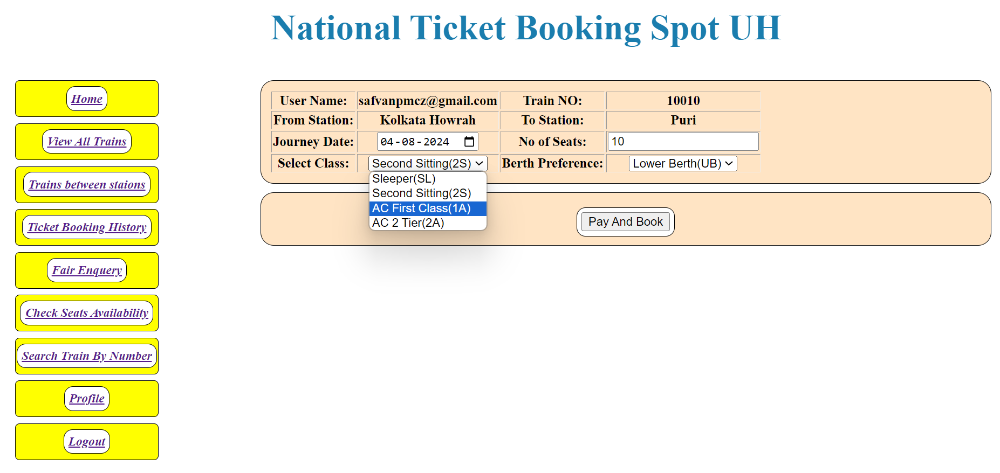
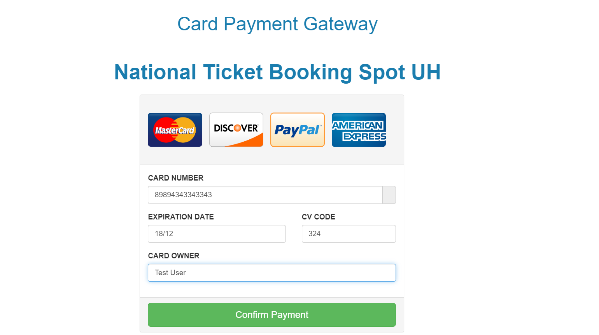
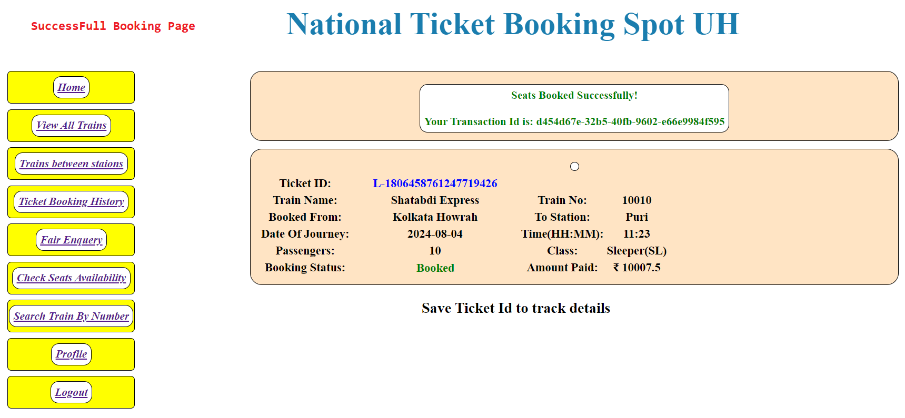
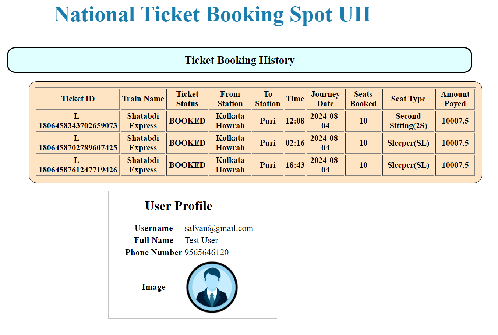

# Train Ticket Reservation System

**About:**

The Train Ticket Reservation System is a web application with a Rest API  designed to provide various functionalities related to train ticket booking and information. It allows users to view train schedules, search for trains, check seat availability, obtain train timings, and inquire about fare details. The system also facilitates booking seats online, ensuring a secure and convenient reservation process.
 
## Key Features: 

- **View Trains Schedule**
- **Search Trains**
- **Check Seats Availability**
- **Train Timings**
- **Fare Enquiry**
- **Trains Between Stations**
- **Booking Seats Online**
- **Login and Logout Security**
- **Password Changes**
- **Payment Gateway**
- **Ticket Booking History**

## Admin Access:
The admin of the system has additional privileges, including:

- **Login**: Admin can log in to access the admin panel.
- **Add Trains**: Admin can add new trains to the system.
- **Update Train Details**: Admin can update the details of existing trains.
- **Delete or Cancel Trains**: Admin can delete or cancel trains from the system.
- **View Trains**: Admin can view the list of available trains.
- **Search Trains by Number**: Admin can search for trains using their unique identification numbers.
- **Logout**: Admin can safely log out from the admin panel.

## REST APIs
- Book Tickets 
- Cancel Tickets 
- Access train details via API

## User Access:
Users of the system have the following access and functionalities:

- **Register new User with profile photo**: Users can create new accounts with profile photos.
- **Login**: Users can log in to access their personalized functionalities.
- **View All Trains**: Users can view the list of all available trains.
- **Check Seats Availability**: Users can check the availability of seats on specific trains.
- **Search Trains**: Users can search for trains based on their preferences.
- **Train Availability and Fare Between Stations**: Users can check train availability and fare details between specific stations.
- **Book Tickets**: Users can book train tickets for their desired travel.
- **View Booking History**: Users can view their booking history, including past ticket reservations.
- **View Profile**: Users can view their profile information.
- **Update Profile**: Users can update their profile details.
- **Change Password**: Users can change their account passwords.
- **Logout**: Users can safely log out from the system.

## Technologies Used:
 
**Front-End Technologies:**

- JSP & JSTL
- CSS 
- Bootstrap

**Back-End Development:**

- Java Programming language
- Spring Boot
- Spring MVC 
- Spring AOP 
- Spring Data JPA
- Project Lombok
- MySQL

**Project Management Tool:**

- Maven

**Application Logging:**

- Log4j2

**Web Server:**

- Embedded Apache Tomcat Server
  
These technologies are carefully selected to provide a robust, efficient, and user-friendly solution for the Train Ticket Reservation System.

## Screenshots

### 1-LoginPage

### 2-New User Registration Form

### 3- Check All Available Trains By User

### 4- Train Booking

### 5- Payment Gateway Before Booking

### 6- User Booked Tickets SuccesFully

### 7- Train Booking History and User Profile

### 8- Admin Logged In

### Note: Similar to the user, if an admin registers with the role "ADMIN," they will also have access to all the features mentioned above.

Here's the revised instruction, including the "Register New User" button detail for admin access setup:

---

## Setup Instructions

> **Important:**  
> Before running the application, ensure that:
> - **Lombok** is installed in your IDE. Missing Lombok can cause compile-time errors, as it generates getters, setters, and constructors. For installation help, search for "Lombok installation in IntelliJ or Eclipse" on YouTube.
> - The project is imported as a **Maven** project.
> - Update **database credentials** (username, password, and URL) in the `application.properties` file to match your local setup.

> **Admin Access Setup**  
> - Start the application and navigate to `http://localhost:9999/TRSApp`.
> - Click the **Register New User** button to create a new account.
> - By default, new users are registered with the role `CUSTOMER`.  
> - To grant a user admin rights, go to the database and manually update the user’s role to `ADMIN` in `users` table.
> - Make sure to check out the `develop` branch before running the project, as it contains the latest updates not yet merged into `main`.

## Contributing

🚀 **We welcome contributions to enhance this project!** 🚀

If you have ideas for new features or improvements, please open an issue or submit a pull request. Whether you're looking to fix bugs, improve documentation, or develop new functionalities, your contributions are highly valued.

### Suggestions for Improvement:
- Enhance user interface with modern design
- Implement advanced analytics for ticket booking
- Add multi-language support

We are excited to collaborate and make this project even better. **Let's build something great together!** 💪

**Happy coding!** 🎉
# Train-Tricket-Booking-App

